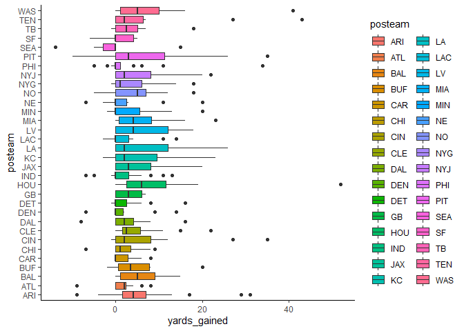

nfl model
================
chad allison \| 1 december 2022

predictive model for nfl games

------------------------------------------------------------------------

### loading required packages

``` r
library(tidyverse)
library(nflreadr)

knitr::opts_chunk$set(message = F, warning = F)
options(nflreadr.verbose = F)
```

``` r
load_pbp(2022) |>
  filter(!is.na(yards_gained) & !is.na(posteam)) |>
  ggplot(aes(reorder(posteam, yards_gained), yards_gained)) +
  geom_boxplot(aes(fill = posteam)) +
  coord_flip() +
  theme_classic()
```

<!-- -->

``` r
pbp_data = data.frame(load_pbp(seasons = 2018:2022))
```

``` r
unique_games = pbp_data |>
  filter(season_type == "REG") |>
  count(game_id)

paste("number of games:", nrow(unique_games))
```

    ## [1] "number of games: 1220"
