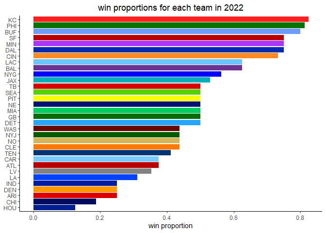

nfl model
================
chad allison \| 1 december 2022

predictive model for nfl games

------------------------------------------------------------------------

### loading required packages

``` r
library(tidyverse)
library(nflreadr)

knitr::opts_chunk$set(message = F, warning = F)
options(nflreadr.verbose = F)
```

``` r
load_pbp(2022) |>
  filter(!is.na(yards_gained) & !is.na(posteam)) |>
  sample_n(500) |>
  ggplot(aes(posteam, yards_gained)) +
  geom_boxplot(aes(fill = posteam)) +
  coord_flip() +
  theme_classic()
```

<!-- -->

``` r
pbp_data = data.frame(load_pbp(seasons = 2018:2022))
```

``` r
unique_games = pbp_data |>
  filter(season_type == "REG") |>
  count(game_id)

paste("number of games:", nrow(unique_games))
```

    ## [1] "number of games: 1221"

``` r
ypg_by_team_2018_forward = pbp_data |>
  filter(season_type == "REG") |>
  filter(!is.na(posteam) & !is.na(yards_gained)) |>
  group_by(game_id, posteam) |>
  summarise(n = n(),
            yds = sum(yards_gained),
            .groups = "drop") |>
  mutate(season = factor(substr(game_id, 1, 4))) |>
  group_by(posteam, season) |>
  summarise(ypg = round(mean(yds), 0),
            .groups = "drop")
```

``` r
ypg_by_team_2018_forward
```

    ## # A tibble: 160 x 3
    ##    posteam season   ypg
    ##    <chr>   <fct>  <dbl>
    ##  1 ARI     2018     242
    ##  2 ARI     2019     342
    ##  3 ARI     2020     385
    ##  4 ARI     2021     374
    ##  5 ARI     2022     336
    ##  6 ATL     2018     389
    ##  7 ATL     2019     380
    ##  8 ATL     2020     369
    ##  9 ATL     2021     304
    ## 10 ATL     2022     316
    ## # ... with 150 more rows

``` r
pbp_data |>
  filter(season_type == "REG") |>
  filter(!is.na(posteam) & !is.na(yards_gained)) |>
  group_by(game_id, posteam) |>
  summarise(n = n(),
            yds = sum(yards_gained),
            .groups = "drop") |>
  mutate(season = factor(substr(game_id, 1, 4))) |>
  ggplot(aes(reorder(posteam, yds), yds)) +
  geom_boxplot(aes(fill = posteam)) +
  coord_flip() +
  theme_classic() +
  scale_fill_manual(values = c(
    "#DD0000", "#B80000", "#6E3390", "#6D9BFF", "#79CAFF", "#000D5F", "#FF8A22",
    "#FF7800", "#002AAF", "#FF9803", "#26A6FF", "#076C00", "#001F93", "#001DA0",
    "#00B0B8", "#FF2121", "#0042FF", "#6CC5FF", "#838383", "#00CE61", "#AC34FF",
    "#001371", "#D6B458", "#0800FF", "#045B00", "#0A7200", "#F7FF00", "#53D200",
    "#BB0000", "#DA0000", "#003472", "#690A00")) +
  labs(x = NULL, y = "total yards", title = "yards per game by team since 2018") +
  theme(plot.title = element_text(hjust = 0.5))
```

<!-- -->
