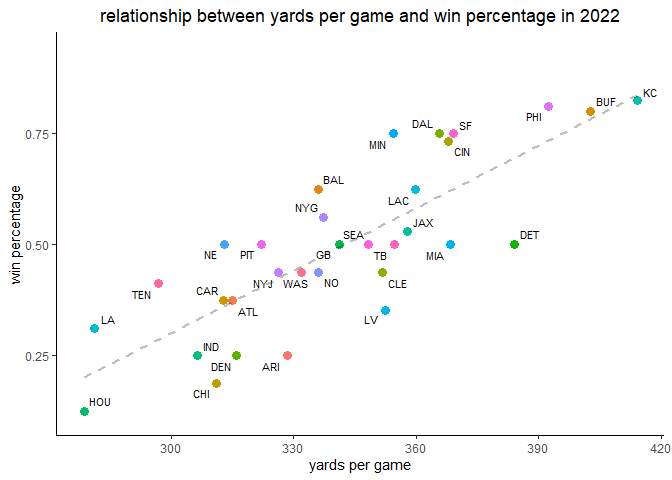
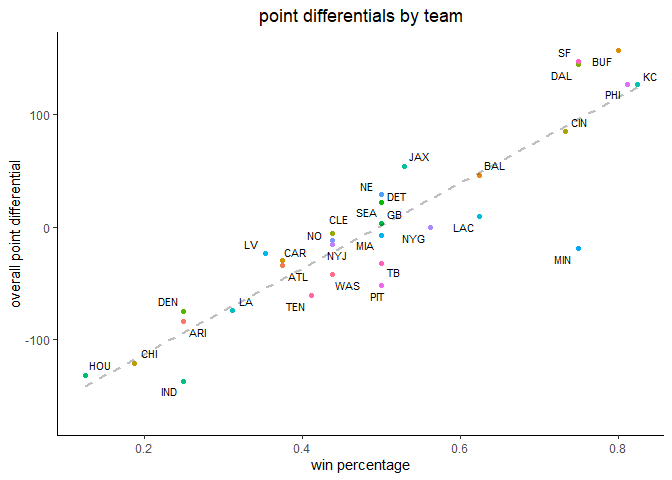
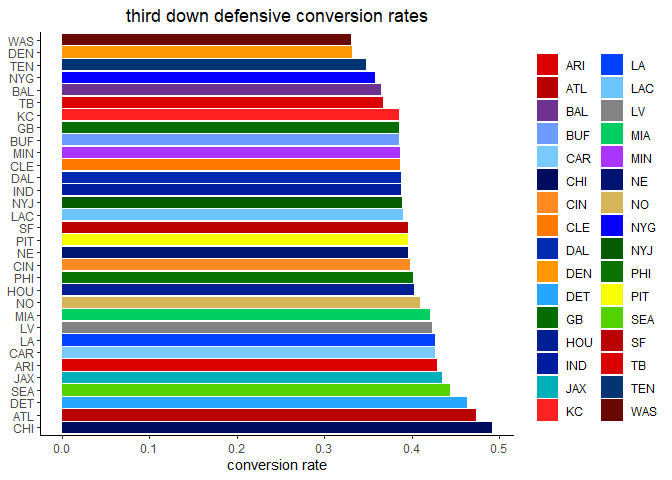
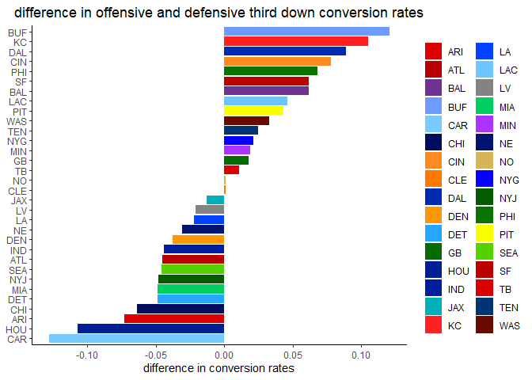
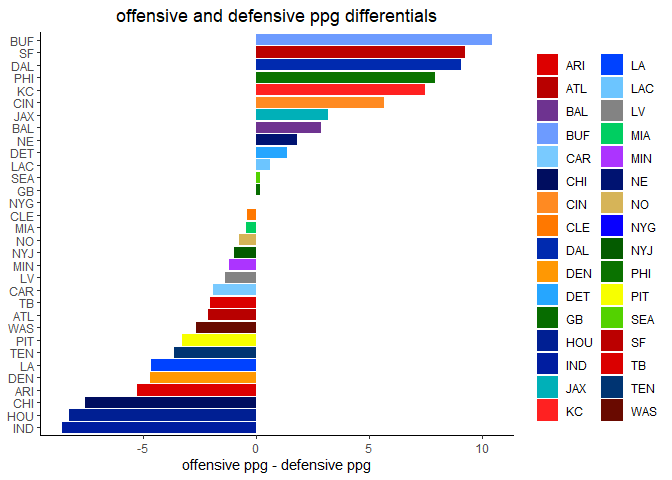
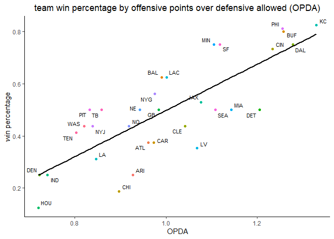
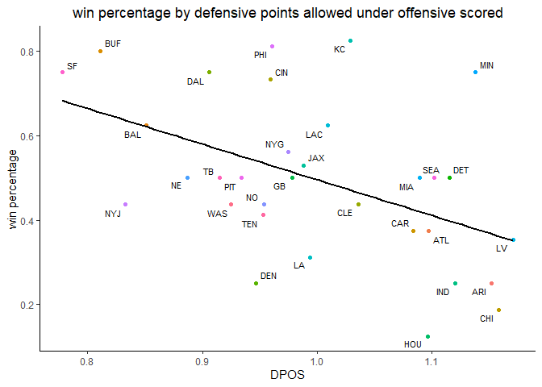

nfl model
================
chad allison

predictive model for nfl games (work in progress)

------------------------------------------------------------------------

<!-- code folding -->
<!-- knitr::knit_hooks$set(source = function(x, options) { -->
<!--   hook.r = function(x, options) { -->
<!--     fence <- "```" -->
<!--     language = tolower(options$engine) -->
<!--     if (language == 'node') language = 'javascript' -->
<!--     if (!options$highlight) language = 'text' -->
<!--     if(!is.null(options$fold_code)) { -->
<!--       paste0('\n\n', "<details><summary>view code</summary>\n", fence, language, '\n', x, fence,  '\n\n', "</details>\n") -->
<!--     } else { -->
<!--       paste0('\n\n', fence, language, '\n', x, fence,  '\n\n') -->
<!--     } -->
<!--   } -->
<!--   x = knitr:::hilight_source(x, 'markdown', options) -->
<!--   hook.r(paste(c(x, ''), collapse = '\n'), options) -->
<!-- }) -->

### loading required packages

``` r
library(tidyverse)
library(nflreadr)

knitr::opts_chunk$set(message = F, warning = F)
options(nflreadr.verbose = F)
theme_set(theme_classic())

add_team_fills = scale_fill_manual(values = c(
    "#DD0000", "#B80000", "#6E3390", "#6D9BFF", "#79CAFF", "#000D5F", "#FF8A22",
    "#FF7800", "#002AAF", "#FF9803", "#26A6FF", "#076C00", "#001F93", "#001DA0",
    "#00B0B8", "#FF2121", "#0042FF", "#6CC5FF", "#838383", "#00CE61", "#AC34FF",
    "#001371", "#D6B458", "#0800FF", "#045B00", "#0A7200", "#F7FF00", "#53D200",
    "#BB0000", "#DA0000", "#003472", "#690A00"))
    
add_team_colors = scale_fill_manual(values = c(
    "#DD0000", "#B80000", "#6E3390", "#6D9BFF", "#79CAFF", "#000D5F", "#FF8A22",
    "#FF7800", "#002AAF", "#FF9803", "#26A6FF", "#076C00", "#001F93", "#001DA0",
    "#00B0B8", "#FF2121", "#0042FF", "#6CC5FF", "#838383", "#00CE61", "#AC34FF",
    "#001371", "#D6B458", "#0800FF", "#045B00", "#0A7200", "#F7FF00", "#53D200",
    "#BB0000", "#DA0000", "#003472", "#690A00"))
```

``` r
start_season = 2022
# write_csv(load_pbp(seasons = start_season:2022), "pbp_data.csv")
df = read_csv("pbp_data.csv", col_types = cols()) # this prevents message popup
head(df)
```

    ## # A tibble: 6 x 372
    ##   play_id game_id  old_g~1 home_~2 away_~3 seaso~4  week posteam poste~5 defteam
    ##     <dbl> <chr>      <dbl> <chr>   <chr>   <chr>   <dbl> <chr>   <chr>   <chr>  
    ## 1       1 2022_01~  2.02e9 NYJ     BAL     REG         1 <NA>    <NA>    <NA>   
    ## 2      43 2022_01~  2.02e9 NYJ     BAL     REG         1 NYJ     home    BAL    
    ## 3      68 2022_01~  2.02e9 NYJ     BAL     REG         1 NYJ     home    BAL    
    ## 4      89 2022_01~  2.02e9 NYJ     BAL     REG         1 NYJ     home    BAL    
    ## 5     115 2022_01~  2.02e9 NYJ     BAL     REG         1 NYJ     home    BAL    
    ## 6     136 2022_01~  2.02e9 NYJ     BAL     REG         1 NYJ     home    BAL    
    ## # ... with 362 more variables: side_of_field <chr>, yardline_100 <dbl>,
    ## #   game_date <date>, quarter_seconds_remaining <dbl>,
    ## #   half_seconds_remaining <dbl>, game_seconds_remaining <dbl>,
    ## #   game_half <chr>, quarter_end <dbl>, drive <dbl>, sp <dbl>, qtr <dbl>,
    ## #   down <dbl>, goal_to_go <dbl>, time <time>, yrdln <chr>, ydstogo <dbl>,
    ## #   ydsnet <dbl>, desc <chr>, play_type <chr>, yards_gained <dbl>,
    ## #   shotgun <dbl>, no_huddle <dbl>, qb_dropback <dbl>, qb_kneel <dbl>, ...

``` r
unique_games = df |>
  filter(season_type == "REG") |>
  count(game_id)

paste("number of regular season games in data:", nrow(unique_games))
```

    ## [1] "number of regular season games in data: 257"

``` r
team_stats = df |>
  filter(season_type == "REG") |>
  filter(!is.na(posteam) & !is.na(yards_gained)) |>
  group_by(game_id, posteam) |>
  summarise(n = n(),
            yds = sum(yards_gained),
            .groups = "drop") |>
  mutate(season = factor(substr(game_id, 1, 4))) |>
  group_by(posteam, season) |>
  summarise(ypg = round(mean(yds), 0),
            .groups = "drop")
```

``` r
team_stats |>
  ggplot(aes(reorder(posteam, ypg), ypg)) +
  geom_col(position = "stack", width = 0.7, aes(fill = posteam)) +
  coord_flip() +
  add_team_fills +
  labs(x = NULL, y = "yards per game",
       title = paste("yards per game by team in", start_season)) +
  theme(legend.position = "none",
        plot.title = element_text(hjust = 0.5))
```

<!-- -->

``` r
df |>
  filter(season_type == "REG") |>
  filter(!is.na(posteam) & !is.na(yards_gained)) |>
  group_by(game_id, posteam) |>
  summarise(n = n(),
            yds = sum(yards_gained),
            .groups = "drop") |>
  # mutate(season = factor(substr(game_id, 1, 4))) |>
  ggplot(aes(reorder(posteam, yds), yds)) +
  geom_boxplot(aes(fill = posteam)) +
  coord_flip() +
  theme_classic() +
  add_team_fills +
  labs(x = NULL, y = "total yards", title = paste("yards per game by team in", start_season)) +
  theme(plot.title = element_text(hjust = 0.5))
```

<!-- -->

``` r
game_results = df |>
  filter(season_type == "REG" & desc == "END GAME") |>
  select(home_team, away_team, total_home_score, total_away_score) |>
  mutate(win_team = case_when(total_home_score > total_away_score ~ "home",
                              total_away_score > total_home_score ~ "away",
                              total_home_score == total_away_score ~ "tie"))

wl_df = data.frame(team = NULL, wins = NULL, losses = NULL, ties = NULL)

all_teams = game_results |>
  distinct(home_team) |>
  pull(home_team)

for (i in 1:length(all_teams)) {
  
  home_data = game_results |>
    filter(home_team == all_teams[i])
  
  away_data = game_results |>
    filter(away_team == all_teams[i])
  
  home_wins = home_data |>
    filter(win_team == "home") |>
    nrow()
  
  away_wins = away_data |>
    filter(win_team == "away") |>
    nrow()
  
  home_losses = home_data |>
    filter(win_team == "away") |>
    nrow()
  
  away_losses = away_data |>
    filter(win_team == "home") |>
    nrow()
  
  home_ties = home_data |>
    filter(win_team == "tie") |>
    nrow()
  
  away_ties = away_data |>
    filter(win_team == "tie") |>
    nrow()
  
  new_data = data.frame(team = all_teams[i],
                        wins = home_wins + away_wins,
                        losses = home_losses + away_losses,
                        ties = home_ties + away_ties)
  
  wl_df = rbind(wl_df, new_data)
  
}

wl_df |>
  mutate(win_prop = round(wins / (wins + losses + ties), 3)) |>
  ggplot(aes(reorder(team, win_prop), win_prop)) +
  geom_col(aes(fill = team)) +
  add_team_fills +
  coord_flip() +
  labs(x = NULL, y = "win proportion",
       title = paste("win proportions for each team in", start_season)) +
  theme(plot.title = element_text(hjust = 0.5),
        legend.position = "none")
```

<!-- -->

``` r
wl_df = wl_df |>
  mutate(win_prop = round(wins / (wins + losses + ties), 3))
```

``` r
team_ypg = df |>
  filter(season_type == "REG") |>
  filter(!is.na(posteam) & !is.na(yards_gained)) |>
  group_by(game_id, posteam) |>
  summarise(n = n(),
            yds = sum(yards_gained),
            .groups = "drop") |>
  group_by(posteam) |>
  summarise(ypg = mean(yds)) |>
  rename(team = posteam)

wl_df |>
  mutate(win_prop = round(wins / (wins + losses + ties), 3)) |>
  left_join(team_ypg, by = "team") |>
  ggplot(aes(ypg, win_prop)) +
  geom_point(aes(col = team), size = 3) +
  geom_line(stat = "smooth", method = "lm", formula = y ~ x, linewidth = 1, linetype = "dashed", alpha = 0.25) +
  ggrepel::geom_text_repel(aes(x = ypg, 
                      y = win_prop, 
                      label = team),
                      size = 3) +
  add_team_colors +
  labs(x = "yards per game", y = "win percentage", col = NULL,
       title = paste("relationship between yards per game and win percentage in", start_season)) +
  theme(plot.title = element_text(hjust = 0.5),
        legend.position = "none")
```

<!-- -->

``` r
# adding win_prop to team_stats
team_stats = wl_df |>
  select(team, win_prop) |>
  right_join(team_stats, by = c("team" = "posteam")) |>
  select(-season)

team_stats = df |>
  filter(season_type == "REG") |>
  filter(!is.na(defteam) & !is.na(yards_gained)) |>
  group_by(game_id, defteam) |>
  summarise(n = n(),
            yds = sum(yards_gained),
            .groups = "drop") |>
  mutate(season = factor(substr(game_id, 1, 4))) |>
  group_by(defteam, season) |>
  summarise(ypg = round(mean(yds), 0),
            .groups = "drop") |>
  select(defteam, ypg) |>
  right_join(team_stats, by = c("defteam" = "team")) |>
  rename(off_ypg = ypg.y,
         def_ypg = ypg.x,
         team = defteam) |>
  select(team, win_prop, off_ypg, def_ypg)
```

``` r
new_gr = game_results |>
  left_join(wl_df, by = c("home_team" = "team")) |>
  rename(home_win_prop = win_prop) |>
  select(-c(wins, losses, ties)) |>
  left_join(wl_df, by = c("away_team" = "team")) |>
  rename(away_win_prop = win_prop) |>
  select(-c(wins, losses, ties))

head(new_gr) # use this to make the record above .500 column
```

    ## # A tibble: 6 x 7
    ##   home_team away_team total_home_score total_away_score win_team home_~1 away_~2
    ##   <chr>     <chr>                <dbl>            <dbl> <chr>      <dbl>   <dbl>
    ## 1 NYJ       BAL                      9               24 away       0.438   0.625
    ## 2 LA        BUF                     10               31 away       0.312   0.8  
    ## 3 CAR       CLE                     24               26 away       0.375   0.438
    ## 4 SEA       DEN                     17               16 home       0.5     0.25 
    ## 5 MIN       GB                      23                7 home       0.75    0.5  
    ## 6 HOU       IND                     20               20 tie        0.125   0.25 
    ## # ... with abbreviated variable names 1: home_win_prop, 2: away_win_prop

``` r
margins_df = data.frame(team = all_teams, margin = NA)

for (i in 1:nrow(margins_df)) {
  
  team = margins_df$team[i]
  
  home_margin = new_gr |>
    filter(home_team == team) |>
    mutate(margin = total_home_score - total_away_score) |>
    pull(margin) |>
    sum()
  
  away_margin = new_gr |>
    filter(away_team == team) |>
    mutate(margin = total_away_score - total_home_score) |>
    pull(margin) |>
    sum()
  
  margins_df$margin[i] = home_margin + away_margin
  
}

wl_df |>
  left_join(margins_df, by = "team") |>
  ggplot(aes(win_prop, margin)) +
  geom_point(aes(col = team)) +
  geom_line(stat = "smooth", method = "lm", formula = y ~ x, linewidth = 1, linetype = "dashed", alpha = 0.25) +
  ggrepel::geom_text_repel(aes(x = win_prop, 
                      y = margin, 
                      label = team),
                      size = 3) +
  add_team_colors +
  labs(x = "win percentage", y = "overall point differential",
       title = "point differentials by team") +
  theme(plot.title = element_text(hjust = 0.5),
        legend.position = "none")
```

<!-- -->

``` r
# updating team_stats with margins
team_stats = team_stats |>
  left_join(margins_df, by = "team")
```

``` r
all_teams = sort(all_teams)

df500 = data.frame(team = all_teams, wp500 = NA)

for (i in 1:nrow(df500)) {
  
  x = new_gr |>
    filter(home_team == df500$team[i] & away_win_prop >= 0.5) |>
    mutate(home_win = ifelse(win_team == "home", 1, 0)) |>
    summarise(x = sum(home_win),
              n = n())
  
  h500w = x |> pull(x)
  h500n = x |> pull(n)
  
  x = new_gr |>
    filter(away_team == df500$team[i] & home_win_prop >= 0.5) |>
    mutate(away_win = ifelse(win_team == "away", 1, 0)) |>
    summarise(x = sum(away_win),
              n = n())
  
  a500w = x |> pull(x)
  a500n = x |> pull(n)
  
  df500$wp500[i] = round((h500w + a500w) / (h500n + a500n), 3)
  
  
}

# adding win percentage v. .500 or better teams to team_stats
team_stats = team_stats |>
  left_join(df500, by = "team")
```

``` r
# create home and away win percentages
home_away_wp = data.frame(team = all_teams, home_wp = NA, away_wp = NA)
for (i in 1:nrow(home_away_wp)) {
  
  home_wp = new_gr |>
    filter(home_team == home_away_wp$team[i]) |>
    mutate(home_win = ifelse(win_team == "home", 1, 0)) |>
    summarise(x = sum(home_win),
              n = n()) |>
    transmute(p = x / n) |>
    pull(p) |>
    round(3)
  
  away_wp = new_gr |>
    filter(away_team == home_away_wp$team[i]) |>
    mutate(away_win = ifelse(win_team == "away", 1, 0)) |>
    summarise(x = sum(away_win),
              n = n()) |>
    transmute(p = x / n) |>
    pull(p) |>
    round(3)
  
  home_away_wp$home_wp[i] = home_wp
  home_away_wp$away_wp[i] = away_wp
  
}

# updating team_stats with home and away win percentages
team_stats = team_stats |>
  left_join(home_away_wp, by = "team")
```

``` r
# add third and fourth down rates
# and ytg on third down
# penalties

off_ytg3 = df |>
  filter(down == 3 & !play_type %in% c("no_play", "punt", "field_goal", "qb_kneel") & !is.na(play_type)) |>
  group_by(posteam) |>
  summarise(ytg3 = round(mean(ydstogo), 3))

off_conv3 = df |>
  filter(down == 3 & !play_type %in% c("no_play", "punt", "field_goal", "qb_kneel") & !is.na(play_type)) |>
  transmute(posteam, ydstogo, yards_gained,
            converted = ifelse(yards_gained >= ydstogo, 1, 0))  |>
  group_by(posteam) |>
  summarise(conv3 = round(sum(converted) / n(), 3))

def_ytg3 = df |>
  filter(down == 3 & !play_type %in% c("no_play", "punt", "field_goal", "qb_kneel") & !is.na(play_type)) |>
  group_by(defteam) |>
  summarise(ytg3 = round(mean(ydstogo), 3))

def_conv3 = df |>
  filter(down == 3 & !play_type %in% c("no_play", "punt", "field_goal", "qb_kneel") & !is.na(play_type)) |>
  transmute(defteam, ydstogo, yards_gained,
            converted = ifelse(yards_gained >= ydstogo, 1, 0))  |>
  group_by(defteam) |>
  summarise(conv3 = round(sum(converted) / n(), 3))

df_3rd_down = off_ytg3 |>
  left_join(off_conv3, by = "posteam") |>
  rename(off_ytg3 = ytg3,
         off_conv3 = conv3) |>
  left_join(def_ytg3, by = c("posteam" = "defteam")) |>
  rename(def_ytg3 = ytg3) |>
  left_join(def_conv3, by = c("posteam" = "defteam")) |>
  rename(def_conv3 = conv3,
         team = posteam)

rm(off_ytg3, off_conv3, def_ytg3, def_conv3)
    
df_3rd_down |>
  ggplot(aes(reorder(team, off_conv3), off_conv3)) +
  geom_col(aes(fill = team)) +
  coord_flip() +
  labs(x = NULL, y = "conversion rate", fill = NULL,
       title = "third down offensive conversion rates") +
  theme(plot.title = element_text(hjust = 0.5)) +
  add_team_fills
```

<!-- -->

``` r
df_3rd_down |>
  ggplot(aes(reorder(team, -def_conv3), def_conv3)) +
  geom_col(aes(fill = team)) +
  coord_flip() +
  labs(x = NULL, y = "conversion rate", fill = NULL,
       title = "third down defensive conversion rates") +
  theme(plot.title = element_text(hjust = 0.5)) +
  add_team_fills
```

<!-- -->

``` r
df_3rd_down |>
  transmute(team, conv = off_conv3 - def_conv3) |>
  ggplot(aes(reorder(team, conv), conv)) +
  geom_col(aes(fill = team)) +
  coord_flip() +
  labs(x = NULL, y = "difference in conversion rates", fill = NULL,
       title = "difference in offensive and defensive third down conversion rates") +
  theme(plot.title = element_text(hjust = 0.5)) +
  add_team_fills
```

<!-- -->

``` r
off_conv4 = df |>
  filter(down == 4 & !play_type %in% c("no_play", "punt", "field_goal", "qb_kneel") & !is.na(play_type)) |>
  select(posteam, ydstogo, yards_gained) |>
  mutate(converted = ifelse(yards_gained >= ydstogo, 1, 0)) |>
  group_by(posteam) |>
  summarise(off_conv4 = round(sum(converted) / n(), 3))

def_conv4 = df |>
  filter(down == 4 & !play_type %in% c("no_play", "punt", "field_goal", "qb_kneel") & !is.na(play_type)) |>
  select(defteam, ydstogo, yards_gained) |>
  mutate(converted = ifelse(yards_gained >= ydstogo, 1, 0)) |>
  group_by(defteam) |>
  summarise(def_conv4 = round(sum(converted) / n(), 3))

df_4th_down = off_conv4 |>
  left_join(def_conv4, by = c("posteam" = "defteam")) |>
  rename(team = posteam)

rm(off_conv4, def_conv4)

df_4th_down |>
  ggplot(aes(reorder(team, off_conv4), off_conv4)) +
  geom_col(aes(fill = team)) +
  coord_flip() +
  add_team_fills +
  labs(x = NULL, y = "conversion rate", fill = NULL,
       title = "fourth down offensive conversion rates") +
  theme(plot.title = element_text(hjust = 0.5))
```

<!-- -->

``` r
df_4th_down |>
  ggplot(aes(reorder(team, -def_conv4), def_conv4)) +
  geom_col(aes(fill = team)) +
  coord_flip() +
  add_team_fills +
  labs(x = NULL, y = "conversion rate", fill = NULL,
       title = "fourth down defensive conversion rates") +
  theme(plot.title = element_text(hjust = 0.5))
```

<!-- -->

``` r
df_4th_down |>
  mutate(conv = off_conv4 - def_conv4) |>
  ggplot(aes(reorder(team, conv), conv)) +
  geom_col(aes(fill = team)) +
  coord_flip() +
  add_team_fills +
  labs(x = NULL, y = "difference in conversion rates", fill = NULL,
       title = "difference in offensive and defensive fourth down conversion rates") +
  theme(plot.title = element_text(hjust = 0.5))
```

<!-- -->

``` r
df_3and4 = df_3rd_down |>
  left_join(df_4th_down, by = "team")

team_stats = team_stats |>
  left_join(df_3and4, by = "team")

names(team_stats)
```

    ##  [1] "team"      "win_prop"  "off_ypg"   "def_ypg"   "margin"    "wp500"    
    ##  [7] "home_wp"   "away_wp"   "off_ytg3"  "off_conv3" "def_ytg3"  "def_conv3"
    ## [13] "off_conv4" "def_conv4"

``` r
team_pen_yds = df |>
  filter(!is.na(penalty_team)) |>
  group_by(penalty_team, game_id) |>
  summarise(yds = sum(penalty_yards),
            .groups = "drop") |>
  group_by(penalty_team) |>
  summarise(pen_yds = round(mean(yds), 3)) |>
  rename(team = penalty_team)

# adding penalty yards to team stats
team_stats = team_stats |>
  left_join(team_pen_yds, by = "team")

team_stats |>
  select(team, pen_yds) |>
  sample_n(6)
```

    ## # A tibble: 6 x 2
    ##   team  pen_yds
    ##   <chr>   <dbl>
    ## 1 CAR      52.6
    ## 2 DET      43.6
    ## 3 SEA      52.1
    ## 4 NO       51.6
    ## 5 IND      49  
    ## 6 WAS      49.7

``` r
games_played = df |>
  filter(desc == "END GAME") |>
  count(home_team) |>
  left_join((df |> filter(desc == "END GAME") |> count(away_team)), by = c("home_team" = "away_team")) |>
  transmute(team = home_team,
            n = n.x + n.y)

df_ppg = data.frame(team = all_teams, off_ppg = NA, def_ppg = NA)

for (i in 1:nrow(df_ppg)) {

  # need points per game and points allowed per game
  home_pf = df |>
    filter(home_team == df_ppg$team[i] & desc == "END GAME") |>
    summarise(pts = sum(total_home_score)) |>
    pull(pts)
  
  away_pf = df |>
    filter(away_team == df_ppg$team[i] & desc == "END GAME") |>
    summarise(pts = sum(total_away_score)) |>
    pull(pts)
  
  home_pa = df |>
    filter(home_team == df_ppg$team[i] & desc == "END GAME") |>
    summarise(pts = sum(total_away_score)) |>
    pull(pts)
  
  away_pa = df |>
    filter(away_team == df_ppg$team[i] & desc == "END GAME") |>
    summarise(pts = sum(total_home_score)) |>
    pull(pts)
  
  team_pf = home_pf + away_pf
  team_pa = home_pa + away_pa
  off_ppg = round(team_pf / games_played$n[which(games_played$team == df_ppg$team[i])], 3)
  def_ppg = round(team_pa / games_played$n[which(games_played$team == df_ppg$team[i])], 3)
  
  df_ppg$off_ppg[i] = off_ppg
  df_ppg$def_ppg[i] = def_ppg

}

df_ppg |>
  mutate(ppg_diff = off_ppg - def_ppg) |>
  ggplot(aes(reorder(team, ppg_diff), ppg_diff)) +
  geom_col(aes(fill = team)) +
  coord_flip() +
  labs(x = NULL, y = "offensive ppg - defensive ppg", fill = NULL,
       title = "offensive and defensive ppg differentials") +
  theme(plot.title = element_text(hjust = 0.5)) +
  add_team_fills
```

<!-- -->

``` r
# adding off_ppg and def_ppg to team_stats
team_stats = team_stats |>
  left_join(df_ppg, by = "team")

team_stats |>
  select(team, off_ppg, def_ppg) |>
  sample_n(6)
```

    ## # A tibble: 6 x 3
    ##   team  off_ppg def_ppg
    ##   <chr>   <dbl>   <dbl>
    ## 1 NYG      21.8    21.8
    ## 2 SF       25.8    16.5
    ## 3 DAL      28.8    19.8
    ## 4 CHI      19.6    27.1
    ## 5 PHI      28.4    20.5
    ## 6 CAR      21.1    22.9

``` r
off_pass_ypg = df |>
  filter(play_type == "pass") |>
  group_by(posteam) |>
  summarise(yds = sum(yards_gained)) |>
  rename(team = posteam) |>
  left_join(games_played, by = "team") |>
  mutate(pass_ypg = round(yds / n, 3)) |>
  select(team, pass_ypg)

off_rush_ypg = df |>
  filter(play_type == "run") |>
  group_by(posteam) |>
  summarise(yds = sum(yards_gained)) |>
  rename(team = posteam) |>
  left_join(games_played, by = "team") |>
  mutate(rush_ypg = round(yds / n, 3)) |>
  select(team, rush_ypg)

def_pass_ypg = df |>
  filter(play_type == "pass") |>
  group_by(defteam) |>
  summarise(yds = sum(yards_gained)) |>
  rename(team = defteam) |>
  left_join(games_played, by = "team") |>
  mutate(pass_ypg = round(yds / n, 3)) |>
  select(team, pass_ypg)

def_rush_ypg = df |>
  filter(play_type == "run") |>
  group_by(defteam) |>
  summarise(yds = sum(yards_gained)) |>
  rename(team = defteam) |>
  left_join(games_played, by = "team") |>
  mutate(rush_ypg = round(yds / n, 3)) |>
  select(team, rush_ypg)

pass_rush_ypg = off_pass_ypg |>
  left_join(off_rush_ypg, by = "team") |>
  rename(off_pass_ypg = pass_ypg,
         off_rush_ypg = rush_ypg) |>
  left_join(def_pass_ypg, by = "team") |>
  left_join(def_rush_ypg, by = "team") |>
  rename(def_pass_ypg = pass_ypg,
         def_rush_ypg = rush_ypg)

rm(off_pass_ypg, off_rush_ypg, def_pass_ypg, def_rush_ypg)

pass_rush_ypg |>
  sample_n(6)
```

    ## # A tibble: 6 x 5
    ##   team  off_pass_ypg off_rush_ypg def_pass_ypg def_rush_ypg
    ##   <chr>        <dbl>        <dbl>        <dbl>        <dbl>
    ## 1 IND           202.        105           205.         129.
    ## 2 GB            216.        127.          196.         143.
    ## 3 KC            298         117.          221.         108.
    ## 4 LA            187.         95.6         227.         111.
    ## 5 DEN           208.        109.          205.         114.
    ## 6 PIT           202.        121.          226.         108.

``` r
# adding pass_rush_ypg to team_stats
team_stats = team_stats |>
  left_join(pass_rush_ypg, by = "team")

team_stats |>
  select(1, 18:21) |>
  sample_n(6)
```

    ## # A tibble: 6 x 5
    ##   team  off_pass_ypg off_rush_ypg def_pass_ypg def_rush_ypg
    ##   <chr>        <dbl>        <dbl>        <dbl>        <dbl>
    ## 1 LAC           268.         92.6         196.         143.
    ## 2 LV            231.        121.          243.         124.
    ## 3 WAS           207.        125.          196.         117.
    ## 4 MIN           259.         95.8         274.         124.
    ## 5 NE            206.        109.          215.         107.
    ## 6 LA            187.         95.6         227.         111.

**at this point in time these are the model predictors**

- home team win percentage
- home team offensive ypg
- home team defensive ypg
- home team point differential
- home team win percentage v. teams with .500 or better win percentage
- home team home win percentage
- home team offensive yards to go on third down
- home team offensive third down conversion rate
- home team defensive yards to go on third down
- home team defensive third down conversion rate
- home team offensive fourth down conversion rate
- home team defensive fourth down conversion rate
- home team penalty yards per game
- home team offensive points per game
- home team defensive points per game
- home team offensive pass yards per game
- home team offensive rush yards per game
- home team defensive pass yards per game
- home team defensive rush yards per game
- away team win percentage
- away team offensive ypg
- away team defensive ypg
- away team point differential
- away team win percentage v. teams with .500 or better win percentage
- away team away win percentage
- away team offensive yards to go on third down
- away team offensive third down conversion rate
- away team defensive yards to go on third down
- away team defensive third down conversion rate
- away team offensive fourth down conversion rate
- away team defensive fourth down conversion rate
- away team penalty yards per game
- away team offensive points per game
- away team defensive points per game
- away team offensive pass yards per game
- away team offensive rush yards per game
- away team defensive pass yards per game
- away team defensive rush yards per game

``` r
big_game_res = game_results |>
  left_join(team_stats, by = c("home_team" = "team")) |>
  rename(home_win_prop = win_prop, home_off_ypg = off_ypg, home_def_ypg = def_ypg,
         home_margin = margin, home_wp500 = wp500, home_home_wp = home_wp,
         home_off_ytg3 = off_ytg3, home_off_conv3 = off_conv3,
         home_def_ytg3 = def_ytg3, home_def_conv3 = def_conv3,
         home_off_conv4 = off_conv4, home_def_conv4 = def_conv4,
         home_pen_ypg = pen_yds, home_off_ppg = off_ppg, home_def_ppg = def_ppg,
         home_off_pypg = off_pass_ypg, home_off_rypg = off_rush_ypg,
         home_def_pypg = def_pass_ypg, home_def_rypg = def_rush_ypg) |>
  select(-away_wp) |>
  left_join(team_stats, by = c("away_team" = "team")) |>
  rename(away_win_prop = win_prop, away_off_ypg = off_ypg, away_def_ypg = def_ypg,
         away_margin = margin, away_wp500 = wp500, away_away_wp = away_wp,
         away_off_ytg3 = off_ytg3, away_off_conv3 = off_conv3,
         away_def_ytg3 = def_ytg3, away_def_conv3 = def_conv3,
         away_off_conv4 = off_conv4, away_def_conv4 = def_conv4,
         away_pen_ypg = pen_yds, away_off_ppg = off_ppg, away_def_ppg = def_ppg,
         away_off_pypg = off_pass_ypg, away_off_rypg = off_rush_ypg,
         away_def_pypg = def_pass_ypg, away_def_rypg = def_rush_ypg) |>
  select(-home_wp) |>
  filter(win_team != "tie") |>
  mutate(home_win = ifelse(win_team == "home", 1, 0))

home_pts_df = big_game_res |>
  group_by(home_team) |>
  summarise(home_pts = sum(total_home_score),
            away_def_ppg = sum(away_def_ppg))

away_pts_df = big_game_res |>
  group_by(away_team) |>
  summarise(away_pts = sum(total_away_score),
            home_def_ppg = sum(home_def_ppg))

opda_df = left_join(home_pts_df, away_pts_df, by = c("home_team" = "away_team")) |>
  transmute(team = home_team,
            pts = home_pts + away_pts,
            def_pts = away_def_ppg + home_def_ppg) |>
  mutate(OPDA = round(pts / def_pts, 3))

rm(home_pts_df, away_pts_df)

opda_df |>
  left_join(team_stats, by = "team") |>
  ggplot(aes(OPDA, win_prop)) +
  geom_point(aes(col = team)) +
  geom_smooth(formula = y ~ x, method = "lm", se = F, col = "black") +
  ggrepel::geom_text_repel(aes(x = OPDA,
                      y = win_prop,
                      label = team),
                      size = 3) +
  add_team_colors +
  labs(x = "OPDA",
       y = "win percentage",
       title = "team win percentage by offensive points over defensive allowed (OPDA)") +
  theme(plot.title = element_text(hjust = 0.5),
        legend.position = "none")
```

<!-- -->

``` r
home_pts_df = big_game_res |>
  group_by(home_team) |>
  summarise(home_pa = sum(total_away_score),
            away_off_ppg = sum(away_off_ppg))

away_pts_df = big_game_res |>
  group_by(away_team) |>
  summarise(away_pa = sum(total_home_score),
            home_off_ppg = sum(home_off_ppg))

dpos_df = left_join(home_pts_df, away_pts_df, by = c("home_team" = "away_team")) |>
  transmute(team = home_team,
            pa = home_pa + away_pa,
            avg_ppg = away_off_ppg + home_off_ppg,
            DPOS = round(pa / avg_ppg, 3))

rm(home_pts_df, away_pts_df)

dpos_df |>
  left_join(team_stats, by = "team") |>
  ggplot(aes(DPOS, win_prop)) +
  geom_point(aes(col = team)) +
  geom_smooth(formula = y ~ x, method = "lm", se = F, col = "black") +
  ggrepel::geom_text_repel(aes(x = DPOS,
                      y = win_prop,
                      label = team),
                      size = 3) +
  add_team_colors +
  labs(x = "DPOS", y = "win percentage",
       title = "win percentage by defensive points allowed under offensive scored") +
  theme(plot.title = element_text(hjust = 0.5),
        legend.position = "none")
```

<!-- -->

``` r
opda_df |>
  select(team, OPDA) |>
  left_join(dpos_df, by = "team") |>
  select(team, OPDA, DPOS) |>
  mutate(stat = round(OPDA / DPOS, 3)) |>
  arrange(desc(stat)) |>
  ggplot(aes(reorder(team, stat), stat)) +
  geom_col(aes(fill = team)) +
  coord_flip() +
  add_team_fills +
  labs(x = NULL, y = "OPDA / DPOS", title = "team OPDA / DPOS") +
  theme(plot.title = element_text(hjust = 0.5),
        legend.position = "none")
```

<!-- -->

``` r
stat_df = opda_df |>
  select(team, OPDA) |>
  left_join(dpos_df, by = "team") |>
  select(team, OPDA, DPOS) |>
  transmute(team, stat = round(OPDA / DPOS, 3))

opda_dpos_df = opda_df |>
  select(team, OPDA) |>
  left_join(dpos_df, by = "team") |>
  select(team, OPDA, DPOS)

week18 = data.frame(home = c("LV", "JAX", "PIT", "CIN", "CHI", "BUF", "MIA", "ATL",
                             "NO", "IND", "SF", "WAS", "SEA", "PHI", "DEN", "GB"),
                    away = c("KC", "TEN", "CLE", "BAL", "MIN", "NE", "NYJ", "TB",
                             "CAR", "HOU", "ARI", "DAL", "LA", "NYG", "LAC", "DET"))

wk18_picks = week18 |>
  left_join(stat_df, by = c("home" = "team")) |>
  rename(home_stat = stat) |>
  left_join(stat_df, by = c("away" = "team")) |>
  rename(away_stat = stat) |>
  mutate(winner = ifelse(home_stat >= away_stat, home, away)) |>
  mutate(conf = ifelse(winner == home, home_stat - away_stat, away_stat - home_stat)) |>
  arrange(desc(conf)) |>
  select(home, away, winner, conf)

for (i in 1:16) {
  if (i == 1) print("these picks made entirely off of OPDA and DPOS")
  winner = wk18_picks$winner[i]
  loser = ifelse(wk18_picks$winner[i] == wk18_picks$home[i], wk18_picks$away[i], wk18_picks$home[i])
  conf = round(wk18_picks$conf[i], 3)
  print(paste0(winner, " over ", loser, " (", conf, ")"))
}
```

    ## [1] "these picks made entirely off of OPDA and DPOS"
    ## [1] "SF over ARI (0.632)"
    ## [1] "DAL over WAS (0.525)"
    ## [1] "BUF over NE (0.488)"
    ## [1] "KC over LV (0.381)"
    ## [1] "PHI over NYG (0.307)"
    ## [1] "JAX over TEN (0.247)"
    ## [1] "LAC over DEN (0.23)"
    ## [1] "MIN over CHI (0.196)"
    ## [1] "SEA over LA (0.154)"
    ## [1] "CIN over BAL (0.124)"
    ## [1] "CLE over PIT (0.115)"
    ## [1] "DET over GB (0.075)"
    ## [1] "NO over CAR (0.065)"
    ## [1] "TB over ATL (0.063)"
    ## [1] "MIA over NYJ (0.043)"
    ## [1] "IND over HOU (0.004)"

``` r
# wild card weekend
wild = data.frame(home = c("SF", "BUF", "TB", "JAX", "MIN", "CIN"),
                  away = c("SEA", "MIA", "DAL", "LAC", "NYG", "BAL"))

wc_picks = wild |>
  left_join(stat_df, by = c("home" = "team")) |>
  rename(home_stat = stat) |>
  left_join(stat_df, by = c("away" = "team")) |>
  rename(away_stat = stat) |>
  mutate(winner = ifelse(home_stat >= away_stat, home, away)) |>
  mutate(conf = ifelse(winner == home, home_stat - away_stat, away_stat - home_stat)) |>
  arrange(desc(conf)) |>
  select(home, away, winner, conf)

for (i in 1:6) {
  if (i == 1) print("these picks made entirely off of OPDA and DPOS")
  winner = wc_picks$winner[i]
  loser = ifelse(wc_picks$winner[i] == wc_picks$home[i], wc_picks$away[i], wc_picks$home[i])
  conf = round(wc_picks$conf[i], 3)
  print(paste0(winner, " over ", loser, " (", conf, ")"))
}
```

    ## [1] "these picks made entirely off of OPDA and DPOS"
    ## [1] "BUF over MIA (0.501)"
    ## [1] "DAL over TB (0.472)"
    ## [1] "SF over SEA (0.432)"
    ## [1] "CIN over BAL (0.124)"
    ## [1] "JAX over LAC (0.098)"
    ## [1] "NYG over MIN (0.029)"

``` r
# updating team_stats
team_stats = team_stats |>
  left_join(opda_dpos_df, by = "team") |>
  mutate(OPDA_DPOS = round(OPDA / DPOS, 3))
```

``` r
# updating model
x = game_results |>
  left_join(team_stats, by = c("home_team" = "team")) |>
  rename(home_win_prop = win_prop, home_off_ypg = off_ypg, home_def_ypg = def_ypg,
         home_margin = margin, home_wp500 = wp500, home_home_wp = home_wp,
         home_off_ytg3 = off_ytg3, home_off_conv3 = off_conv3,
         home_def_ytg3 = def_ytg3, home_def_conv3 = def_conv3,
         home_off_conv4 = off_conv4, home_def_conv4 = def_conv4,
         home_pen_ypg = pen_yds, home_off_ppg = off_ppg, home_def_ppg = def_ppg,
         home_off_pypg = off_pass_ypg, home_off_rypg = off_rush_ypg,
         home_def_pypg = def_pass_ypg, home_def_rypg = def_rush_ypg,
         home_OPDA = OPDA, home_DPOS = DPOS, home_OPDA_DPOS = OPDA_DPOS) |>
  select(-away_wp) |>
  left_join(team_stats, by = c("away_team" = "team")) |>
  rename(away_win_prop = win_prop, away_off_ypg = off_ypg, away_def_ypg = def_ypg,
         away_margin = margin, away_wp500 = wp500, away_away_wp = away_wp,
         away_off_ytg3 = off_ytg3, away_off_conv3 = off_conv3,
         away_def_ytg3 = def_ytg3, away_def_conv3 = def_conv3,
         away_off_conv4 = off_conv4, away_def_conv4 = def_conv4,
         away_pen_ypg = pen_yds, away_off_ppg = off_ppg, away_def_ppg = def_ppg,
         away_off_pypg = off_pass_ypg, away_off_rypg = off_rush_ypg,
         away_def_pypg = def_pass_ypg, away_def_rypg = def_rush_ypg,
         away_OPDA = OPDA, away_DPOS = DPOS, away_OPDA_DPOS = OPDA_DPOS) |>
  select(-home_wp) |>
  filter(win_team != "tie") |>
  mutate(home_win = ifelse(win_team == "home", 1, 0))

# win_mod = glm(home_win ~ home_win_prop + home_off_ypg + home_def_ypg + home_margin + home_wp500 + home_home_wp +
#                          home_off_ytg3 + home_off_conv3 + home_def_ytg3 + home_def_conv3 +
#                          home_off_conv4 + home_def_conv4 + home_pen_ypg + home_off_ppg + home_def_ppg +
#                          home_off_pypg + home_off_rypg + home_def_pypg + home_def_rypg +
#                          home_OPDA + home_DPOS + home_OPDA_DPOS +
#                          away_win_prop + away_off_ypg + away_def_ypg + away_margin + away_wp500 + away_away_wp +
#                          away_off_ytg3 + away_off_conv3 + away_def_ytg3 + away_def_conv3 +
#                          away_off_conv4 + away_def_conv4 + away_pen_ypg + away_off_ppg + away_def_ppg +
#                          away_off_pypg + away_off_rypg + away_def_pypg + away_def_rypg +
#                          away_OPDA + away_DPOS + away_OPDA_DPOS,
#               data = x, family = "binomial")

win_mod = glm(home_win ~ home_margin + home_OPDA + home_DPOS + away_margin + away_OPDA + away_DPOS,
              data = x, family = "binomial")
```

``` r
pick_winner = function(home, away) {
  
  matchup = data.frame(home = home, away = away)
  
  matchup = matchup |>
    left_join(team_stats, by = c("home" = "team")) |>
    rename(home_win_prop = win_prop, home_off_ypg = off_ypg, home_def_ypg = def_ypg,
         home_margin = margin, home_wp500 = wp500, home_home_wp = home_wp,
         home_off_ytg3 = off_ytg3, home_off_conv3 = off_conv3,
         home_def_ytg3 = def_ytg3, home_def_conv3 = def_conv3,
         home_off_conv4 = off_conv4, home_def_conv4 = def_conv4,
         home_pen_ypg = pen_yds, home_off_ppg = off_ppg, home_def_ppg = def_ppg,
         home_off_pypg = off_pass_ypg, home_off_rypg = off_rush_ypg,
         home_def_pypg = def_pass_ypg, home_def_rypg = def_rush_ypg,
         home_OPDA = OPDA, home_DPOS = DPOS, home_OPDA_DPOS = OPDA_DPOS) |>
    select(-away_wp) |>
    left_join(team_stats, by = c("away" = "team")) |>
    rename(away_win_prop = win_prop, away_off_ypg = off_ypg, away_def_ypg = def_ypg,
         away_margin = margin, away_wp500 = wp500, away_away_wp = away_wp,
         away_off_ytg3 = off_ytg3, away_off_conv3 = off_conv3,
         away_def_ytg3 = def_ytg3, away_def_conv3 = def_conv3,
         away_off_conv4 = off_conv4, away_def_conv4 = def_conv4,
         away_pen_ypg = pen_yds, away_off_ppg = off_ppg, away_def_ppg = def_ppg,
         away_off_pypg = off_pass_ypg, away_off_rypg = off_rush_ypg,
         away_def_pypg = def_pass_ypg, away_def_rypg = def_rush_ypg,
         away_OPDA = OPDA, away_DPOS = DPOS, away_OPDA_DPOS = OPDA_DPOS) |>
    select(-home_wp)
  
  prob = predict(win_mod, matchup, type = "response")
  winner = ifelse(prob >= 0.5, home, away)
  loser = ifelse(prob >= 0.5, away, home)
  location = ifelse(prob >= 0.5, "v.", "@")
  conf = ifelse(prob >= 0.5, prob, 1 - prob)
  return(paste0(winner, " will win ", location, " ", loser, " (", round(conf, 3), ")"))
  
}

pick_winner_return_team = function(home, away) {
  
  matchup = data.frame(home = home, away = away)
  
  matchup = matchup |>
    left_join(team_stats, by = c("home" = "team")) |>
    rename(home_win_prop = win_prop, home_off_ypg = off_ypg, home_def_ypg = def_ypg,
         home_margin = margin, home_wp500 = wp500, home_home_wp = home_wp,
         home_off_ytg3 = off_ytg3, home_off_conv3 = off_conv3,
         home_def_ytg3 = def_ytg3, home_def_conv3 = def_conv3,
         home_off_conv4 = off_conv4, home_def_conv4 = def_conv4,
         home_pen_ypg = pen_yds, home_off_ppg = off_ppg, home_def_ppg = def_ppg,
         home_off_pypg = off_pass_ypg, home_off_rypg = off_rush_ypg,
         home_def_pypg = def_pass_ypg, home_def_rypg = def_rush_ypg,
         home_OPDA = OPDA, home_DPOS = DPOS, home_OPDA_DPOS = OPDA_DPOS) |>
    select(-away_wp) |>
    left_join(team_stats, by = c("away" = "team")) |>
    rename(away_win_prop = win_prop, away_off_ypg = off_ypg, away_def_ypg = def_ypg,
         away_margin = margin, away_wp500 = wp500, away_away_wp = away_wp,
         away_off_ytg3 = off_ytg3, away_off_conv3 = off_conv3,
         away_def_ytg3 = def_ytg3, away_def_conv3 = def_conv3,
         away_off_conv4 = off_conv4, away_def_conv4 = def_conv4,
         away_pen_ypg = pen_yds, away_off_ppg = off_ppg, away_def_ppg = def_ppg,
         away_off_pypg = off_pass_ypg, away_off_rypg = off_rush_ypg,
         away_def_pypg = def_pass_ypg, away_def_rypg = def_rush_ypg,
         away_OPDA = OPDA, away_DPOS = DPOS, away_OPDA_DPOS = OPDA_DPOS) |>
    select(-home_wp)
  
  prob = predict(win_mod, matchup, type = "response")
  winner = ifelse(prob >= 0.5, home, away)
  loser = ifelse(prob >= 0.5, away, home)
  location = ifelse(prob >= 0.5, "v.", "@")
  conf = ifelse(prob >= 0.5, prob, 1 - prob)
  return(winner)
  
}
```

``` r
acc = game_results |>
  filter(win_team != "tie") |>
  mutate(winner = ifelse(win_team == "home", home_team, away_team),
         pred = pick_winner_return_team(home_team, away_team),
         correct = ifelse(winner == pred, 1, 0)) |>
  summarise(acc = round(sum(correct) / n(), 4) * 100) |>
  pull(acc)

paste0("current model accuracy: ", acc, "%")
```

    ## [1] "current model accuracy: 72.94%"

``` r
df |>
  select(game_id, home_team, away_team) |>
  right_join(game_results, by = c("home_team", "away_team")) |>
  distinct() |>
  mutate(winner = ifelse(win_team == "home", home_team, away_team),
         pred = pick_winner_return_team(home_team, away_team),
         correct = ifelse(winner == pred, "correct prediction", "wrong prediction"),
         bar = 1) |>
  ggplot(aes(game_id, bar)) +
  geom_col(aes(fill = correct), width = 1) +
  scale_fill_manual(values = c("#B6E0B8", "#FFC4C4")) +
  labs(x = NULL, y = NULL, fill = NULL,
       title = "game predictions over course of 2022 season",
       subtitle = "← beginning of season | today →") +
  theme(axis.text = element_blank(),
        axis.line = element_blank(),
        axis.ticks = element_blank(),
        legend.position = "bottom",
        plot.title = element_text(hjust = 0.5),
        plot.subtitle = element_text(hjust = 0.5, size = 9))
```

<!-- -->
