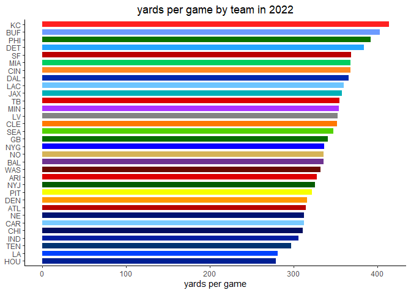

nfl model
================
chad allison \| 1 december 2022

predictive model for nfl games - *work in progress, not even close to
done*

------------------------------------------------------------------------

### loading required packages

``` r
library(tidyverse)
library(nflreadr)

knitr::opts_chunk$set(message = F, warning = F)
options(nflreadr.verbose = F)
theme_set(theme_classic())
```

``` r
start_season = 2022
# write_csv(load_pbp(seasons = start_season:2022), "pbp_data.csv")
df = read_csv("pbp_data.csv", col_types = cols())
```

``` r
unique_games = df |>
  filter(season_type == "REG") |>
  count(game_id)

paste("number of regular season games in data:", nrow(unique_games))
```

    ## [1] "number of regular season games in data: 223"

``` r
team_stats = df |>
  filter(season_type == "REG") |>
  filter(!is.na(posteam) & !is.na(yards_gained)) |>
  group_by(game_id, posteam) |>
  summarise(n = n(),
            yds = sum(yards_gained),
            .groups = "drop") |>
  mutate(season = factor(substr(game_id, 1, 4))) |>
  group_by(posteam, season) |>
  summarise(ypg = round(mean(yds), 0),
            .groups = "drop")
```

``` r
team_stats |>
  ggplot(aes(reorder(posteam, ypg), ypg)) +
  geom_col(position = "stack", width = 0.7, aes(fill = posteam)) +
  coord_flip() +
  scale_fill_manual(values = c(
    "#DD0000", "#B80000", "#6E3390", "#6D9BFF", "#79CAFF", "#000D5F", "#FF8A22",
    "#FF7800", "#002AAF", "#FF9803", "#26A6FF", "#076C00", "#001F93", "#001DA0",
    "#00B0B8", "#FF2121", "#0042FF", "#6CC5FF", "#838383", "#00CE61", "#AC34FF",
    "#001371", "#D6B458", "#0800FF", "#045B00", "#0A7200", "#F7FF00", "#53D200",
    "#BB0000", "#DA0000", "#003472", "#690A00")) +
  labs(x = NULL, y = "yards per game",
       title = paste("yards per game by team each season since", start_season)) +
  theme(legend.position = "none",
        plot.title = element_text(hjust = 0.5))
```

<!-- -->

``` r
df |>
  filter(season_type == "REG") |>
  filter(!is.na(posteam) & !is.na(yards_gained)) |>
  group_by(game_id, posteam) |>
  summarise(n = n(),
            yds = sum(yards_gained),
            .groups = "drop") |>
  # mutate(season = factor(substr(game_id, 1, 4))) |>
  ggplot(aes(reorder(posteam, yds), yds)) +
  geom_boxplot(aes(fill = posteam)) +
  coord_flip() +
  theme_classic() +
  scale_fill_manual(values = c(
    "#DD0000", "#B80000", "#6E3390", "#6D9BFF", "#79CAFF", "#000D5F", "#FF8A22",
    "#FF7800", "#002AAF", "#FF9803", "#26A6FF", "#076C00", "#001F93", "#001DA0",
    "#00B0B8", "#FF2121", "#0042FF", "#6CC5FF", "#838383", "#00CE61", "#AC34FF",
    "#001371", "#D6B458", "#0800FF", "#045B00", "#0A7200", "#F7FF00", "#53D200",
    "#BB0000", "#DA0000", "#003472", "#690A00")) +
  labs(x = NULL, y = "total yards", title = paste("yards per game by team since", start_season)) +
  theme(plot.title = element_text(hjust = 0.5))
```

<!-- -->

``` r
game_results = df |>
  filter(season_type == "REG" & desc == "END GAME") |>
  select(home_team, away_team, total_home_score, total_away_score) |>
  mutate(win_team = case_when(total_home_score > total_away_score ~ "home",
                              total_away_score > total_home_score ~ "away",
                              total_home_score == total_away_score ~ "tie"))

wl_df = data.frame(team = NULL, wins = NULL, losses = NULL, ties = NULL)

all_teams = game_results |>
  distinct(home_team) |>
  pull(home_team)

for (i in 1:length(all_teams)) {
  
  home_data = game_results |>
    filter(home_team == all_teams[i])
  
  away_data = game_results |>
    filter(away_team == all_teams[i])
  
  home_wins = home_data |>
    filter(win_team == "home") |>
    nrow()
  
  away_wins = away_data |>
    filter(win_team == "away") |>
    nrow()
  
  home_losses = home_data |>
    filter(win_team == "away") |>
    nrow()
  
  away_losses = away_data |>
    filter(win_team == "home") |>
    nrow()
  
  home_ties = home_data |>
    filter(win_team == "tie") |>
    nrow()
  
  away_ties = away_data |>
    filter(win_team == "tie") |>
    nrow()
  
  new_data = data.frame(team = all_teams[i],
                        wins = home_wins + away_wins,
                        losses = home_losses + away_losses,
                        ties = home_ties + away_ties)
  
  wl_df = rbind(wl_df, new_data)
  
}

wl_df |>
  mutate(win_prop = round(wins / (wins + losses + ties), 3)) |>
  ggplot(aes(reorder(team, win_prop), win_prop)) +
  geom_col(aes(fill = team)) +
  scale_fill_manual(values = c(
    "#DD0000", "#B80000", "#6E3390", "#6D9BFF", "#79CAFF", "#000D5F", "#FF8A22",
    "#FF7800", "#002AAF", "#FF9803", "#26A6FF", "#076C00", "#001F93", "#001DA0",
    "#00B0B8", "#FF2121", "#0042FF", "#6CC5FF", "#838383", "#00CE61", "#AC34FF",
    "#001371", "#D6B458", "#0800FF", "#045B00", "#0A7200", "#F7FF00", "#53D200",
    "#BB0000", "#DA0000", "#003472", "#690A00")) +
  coord_flip() +
  labs(x = NULL, y = "win proportion",
       title = paste("win proportions for each team since", start_season)) +
  theme(plot.title = element_text(hjust = 0.5),
        legend.position = "none")
```

<!-- -->

``` r
wl_df = wl_df |>
  mutate(win_prop = round(wins / (wins + losses + ties), 3))
```

``` r
df |>
  filter(season_type == "REG") |>
  filter(!is.na(posteam) & !is.na(yards_gained)) |>
  group_by(game_id, posteam) |>
  summarise(n = n(),
            yds = sum(yards_gained),
            .groups = "drop") |>
  ggplot(aes(n, yds)) +
  geom_point(aes(col = posteam), alpha = 0.5) +
  scale_color_manual(values = c(
    "#DD0000", "#B80000", "#6E3390", "#6D9BFF", "#79CAFF", "#000D5F", "#FF8A22",
    "#FF7800", "#002AAF", "#FF9803", "#26A6FF", "#076C00", "#001F93", "#001DA0",
    "#00B0B8", "#FF2121", "#0042FF", "#6CC5FF", "#838383", "#00CE61", "#AC34FF",
    "#001371", "#D6B458", "#0800FF", "#045B00", "#0A7200", "#F7FF00", "#53D200",
    "#BB0000", "#DA0000", "#003472", "#690A00")) +
  annotate("text", x = 105, y = 100, label = "i promise this is\ncooler with plotly")
```

<!-- -->

``` r
team_ypg = df |>
  filter(season_type == "REG") |>
  filter(!is.na(posteam) & !is.na(yards_gained)) |>
  group_by(game_id, posteam) |>
  summarise(n = n(),
            yds = sum(yards_gained),
            .groups = "drop") |>
  group_by(posteam) |>
  summarise(ypg = mean(yds)) |>
  rename(team = posteam)

wl_df |>
  mutate(win_prop = round(wins / (wins + losses + ties), 3)) |>
  left_join(team_ypg, by = "team") |>
  ggplot(aes(ypg, win_prop)) +
  geom_point(aes(col = team), size = 3) +
  ggrepel::geom_text_repel(aes(x = ypg, 
                      y = win_prop, 
                      label = team),
                      size = 3) +
  scale_color_manual(values = c(
    "#DD0000", "#B80000", "#6E3390", "#6D9BFF", "#79CAFF", "#000D5F", "#FF8A22",
    "#FF7800", "#002AAF", "#FF9803", "#26A6FF", "#076C00", "#001F93", "#001DA0",
    "#00B0B8", "#FF2121", "#0042FF", "#6CC5FF", "#838383", "#00CE61", "#AC34FF",
    "#001371", "#D6B458", "#0800FF", "#045B00", "#0A7200", "#F7FF00", "#53D200",
    "#BB0000", "#DA0000", "#003472", "#690A00")) +
  labs(x = "yards per game", y = "win percentage", col = NULL,
       title = paste("relationship between yards per game and win percentage since", start_season)) +
  theme(plot.title = element_text(hjust = 0.5),
        legend.position = "none")
```

<!-- -->

``` r
xyz = game_results |>
  left_join(team_stats, by = c("home_team" = "posteam")) |>
  select(-season) |>
  rename(home_ypg = ypg) |>
  left_join(team_stats, by = c("away_team" = "posteam")) |>
  select(-season) |>
  rename(away_ypg = ypg) |>
  filter(win_team != "tie") |>
  mutate(home_win = ifelse(win_team == "home", 1, 0))

win_mod = glm(home_win ~ home_ypg + away_ypg, data = xyz, family = "binomial")

predict_winner = function(home, away) {
  
  matchup = data.frame(home_team = home, away_team = away)
  
  matchup = matchup |>
    left_join(team_stats, by = c("home_team" = "posteam")) |>
    select(-season) |>
    rename(home_ypg = ypg) |>
    left_join(team_stats, by = c("away_team" = "posteam")) |>
    select(-season) |>
    rename(away_ypg = ypg)
  
  home_win_prob = predict(win_mod, matchup, type = "response")
  winner = ifelse(home_win_prob >= 0.5, home, away)
  loser = ifelse(home_win_prob >= 0.5, away, home)
  paste(winner, "will defeat", loser)
  
}

predict_winner("CHI", "PHI")
```

    ## [1] "PHI will defeat CHI"

``` r
predict_winner("MIN", "IND")
```

    ## [1] "MIN will defeat IND"

``` r
predict_winner("CLE", "BAL")
```

    ## [1] "CLE will defeat BAL"

``` r
predict_winner("BUF", "MIA")
```

    ## [1] "BUF will defeat MIA"

``` r
predict_winner("NYJ", "DET")
```

    ## [1] "DET will defeat NYJ"

``` r
predict_winner("CAR", "PIT")
```

    ## [1] "PIT will defeat CAR"

``` r
# adding win_prop to team_stats
team_stats = wl_df |>
  select(team, win_prop) |>
  right_join(team_stats, by = c("team" = "posteam")) |>
  select(-season)

team_stats = df |>
  filter(season_type == "REG") |>
  filter(!is.na(defteam) & !is.na(yards_gained)) |>
  group_by(game_id, defteam) |>
  summarise(n = n(),
            yds = sum(yards_gained),
            .groups = "drop") |>
  mutate(season = factor(substr(game_id, 1, 4))) |>
  group_by(defteam, season) |>
  summarise(ypg = round(mean(yds), 0),
            .groups = "drop") |>
  select(defteam, ypg) |>
  right_join(team_stats, by = c("defteam" = "team")) |>
  rename(off_ypg = ypg.y,
         def_ypg = ypg.x,
         team = defteam) |>
  select(team, win_prop, off_ypg, def_ypg)
```

``` r
x = game_results |>
  left_join(team_stats, by = c("home_team" = "team")) |>
  rename(home_win_prop = win_prop,
         home_off_ypg = off_ypg,
         home_def_ypg = def_ypg) |>
  left_join(team_stats, by = c("away_team" = "team")) |>
  rename(away_win_prop = win_prop,
         away_off_ypg = off_ypg,
         away_def_ypg = def_ypg) |>
  filter(win_team != "tie") |>
  mutate(home_win = ifelse(win_team == "home", 1, 0))

win_mod = glm(home_win ~ home_win_prop + home_off_ypg + home_def_ypg +
                         away_win_prop + away_off_ypg + away_def_ypg,
              data = x, family = "binomial")

# need df with matchup stats

matchup = data.frame(home = "CHI", away = "PHI")

matchup = matchup |>
  left_join(team_stats, by = c("home" = "team")) |>
  rename(home_win_prop = win_prop,
         home_off_ypg = off_ypg,
         home_def_ypg = def_ypg) |>
  left_join(team_stats, by = c("away" = "team")) |>
  rename(away_win_prop = win_prop,
         away_off_ypg = off_ypg,
         away_def_ypg = def_ypg)

pick_winner = function(home, away) {
  
  matchup = data.frame(home = home, away = away)
  
  matchup = matchup |>
    left_join(team_stats, by = c("home" = "team")) |>
    rename(home_win_prop = win_prop,
           home_off_ypg = off_ypg,
           home_def_ypg = def_ypg) |>
    left_join(team_stats, by = c("away" = "team")) |>
    rename(away_win_prop = win_prop,
           away_off_ypg = off_ypg,
           away_def_ypg = def_ypg)
  
  prob = predict(win_mod, matchup, type = "response")
  winner = ifelse(prob >= 0.5, home, away)
  loser = ifelse(prob >= 0.5, away, home)
  location = ifelse(prob >= 0.5, "v.", "@")
  conf = ifelse(prob >= 0.5, prob, 1 - prob)
  return(paste0(winner, " will win ", location, " ", loser, " (", round(conf, 3), ")"))
  
}

pick_winner("CHI", "PHI")
```

    ## [1] "PHI will win @ CHI (0.961)"

``` r
pick_winner_return_team = function(home, away) {
  
  matchup = data.frame(home = home, away = away)
  
  matchup = matchup |>
    left_join(team_stats, by = c("home" = "team")) |>
    rename(home_win_prop = win_prop,
           home_off_ypg = off_ypg,
           home_def_ypg = def_ypg) |>
    left_join(team_stats, by = c("away" = "team")) |>
    rename(away_win_prop = win_prop,
           away_off_ypg = off_ypg,
           away_def_ypg = def_ypg)
  
  prob = predict(win_mod, matchup, type = "response")
  winner = ifelse(prob >= 0.5, home, away)
  loser = ifelse(prob >= 0.5, away, home)
  location = ifelse(prob >= 0.5, "v.", "@")
  conf = ifelse(prob >= 0.5, prob, 1 - prob)
  return(winner)
  
}
```

``` r
week15 = data.frame(home = c("SEA", "MIN", "CLE", "BUF", "CHI", "NYJ", "CAR", "HOU",
                    "NO", "JAX", "DEN", "LV", "LAC", "TB", "WAS", "GB"),
           away = c("SF", "IND", "BAL", "MIA", "PHI", "DET", "PIT", "KC",
                    "ATL", "DAL", "ARI", "NE", "TEN", "CIN", "NYG", "LA"))

week15 |>
  mutate(winner = pick_winner_return_team(home, away),
         msg = pick_winner(home, away))
```

    ##    home away winner                         msg
    ## 1   SEA   SF     SF   SF will win @ SEA (0.656)
    ## 2   MIN  IND    MIN MIN will win v. IND (0.937)
    ## 3   CLE  BAL    BAL  BAL will win @ CLE (0.646)
    ## 4   BUF  MIA    BUF BUF will win v. MIA (0.848)
    ## 5   CHI  PHI    PHI  PHI will win @ CHI (0.961)
    ## 6   NYJ  DET    NYJ NYJ will win v. DET (0.565)
    ## 7   CAR  PIT    PIT  PIT will win @ CAR (0.621)
    ## 8   HOU   KC     KC    KC will win @ HOU (0.97)
    ## 9    NO  ATL     NO  NO will win v. ATL (0.565)
    ## 10  JAX  DAL    DAL  DAL will win @ JAX (0.729)
    ## 11  DEN  ARI    DEN DEN will win v. ARI (0.602)
    ## 12   LV   NE     LV   LV will win v. NE (0.522)
    ## 13  LAC  TEN    LAC LAC will win v. TEN (0.585)
    ## 14   TB  CIN    CIN   CIN will win @ TB (0.743)
    ## 15  WAS  NYG    NYG  NYG will win @ WAS (0.568)
    ## 16   GB   LA     GB    GB will win v. LA (0.67)

``` r
res = x |>
  mutate(pred_winner = pick_winner_return_team(home_team, away_team),
         correct = case_when(home_win == 0 & pred_winner == away_team ~ 1,
                             home_win == 0 & pred_winner == home_team ~ 0,
                             home_win == 1 & pred_winner == home_team ~ 1,
                             home_win == 1 & pred_winner == away_team ~ 0)) |>
  count(correct) |>
  pull(n)

acc = round(res[2] / sum(res), 3)
paste("current model accuracy:", acc)
```

    ## [1] "current model accuracy: 0.724"

``` r
new_gr = game_results |>
  left_join(wl_df, by = c("home_team" = "team")) |>
  rename(home_win_prop = win_prop) |>
  select(-c(wins, losses, ties)) |>
  left_join(wl_df, by = c("away_team" = "team")) |>
  rename(away_win_prop = win_prop) |>
  select(-c(wins, losses, ties))

head(new_gr) # use this to make the record above .500 column
```

    ## # A tibble: 6 × 7
    ##   home_team away_team total_home_score total_away_score win_team home_win_prop
    ##   <chr>     <chr>                <dbl>            <dbl> <chr>            <dbl>
    ## 1 NYJ       BAL                      9               24 away             0.5  
    ## 2 LA        BUF                     10               31 away             0.308
    ## 3 CAR       CLE                     24               26 away             0.357
    ## 4 SEA       DEN                     17               16 home             0.5  
    ## 5 MIN       GB                      23                7 home             0.786
    ## 6 HOU       IND                     20               20 tie              0.071
    ## # … with 1 more variable: away_win_prop <dbl>

``` r
margins_df = data.frame(team = all_teams, margin = NA)

for (i in 1:nrow(margins_df)) {
  
  team = margins_df$team[i]
  
  home_margin = new_gr |>
    filter(home_team == team) |>
    mutate(margin = total_home_score - total_away_score) |>
    pull(margin) |>
    sum()
  
  away_margin = new_gr |>
    filter(away_team == team) |>
    mutate(margin = total_away_score - total_home_score) |>
    pull(margin) |>
    sum()
  
  margins_df$margin[i] = home_margin + away_margin
  
}

wl_df |>
  left_join(margins_df, by = "team") |>
  ggplot(aes(win_prop, margin)) +
  geom_point(aes(col = team)) +
  geom_line(stat = "smooth", method = "lm", formula = y ~ x, size = 1, linetype = "dashed", alpha = 0.25) +
  ggrepel::geom_text_repel(aes(x = win_prop, 
                      y = margin, 
                      label = team),
                      size = 3) +
  scale_color_manual(values = c(
    "#DD0000", "#B80000", "#6E3390", "#6D9BFF", "#79CAFF", "#000D5F", "#FF8A22",
    "#FF7800", "#002AAF", "#FF9803", "#26A6FF", "#076C00", "#001F93", "#001DA0",
    "#00B0B8", "#FF2121", "#0042FF", "#6CC5FF", "#838383", "#00CE61", "#AC34FF",
    "#001371", "#D6B458", "#0800FF", "#045B00", "#0A7200", "#F7FF00", "#53D200",
    "#BB0000", "#DA0000", "#003472", "#690A00")) +
  labs(x = "win percentage", y = "overall point differential",
       title = "point differentials by team") +
  theme(plot.title = element_text(hjust = 0.5),
        legend.position = "none")
```

<!-- -->
